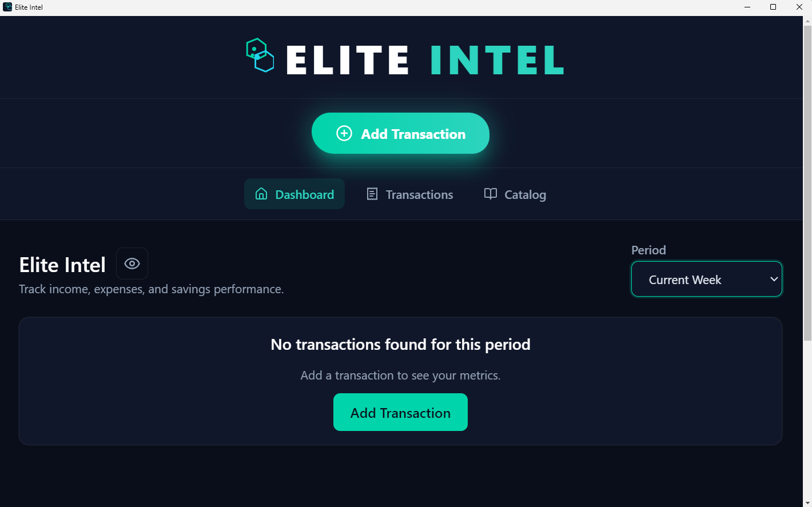
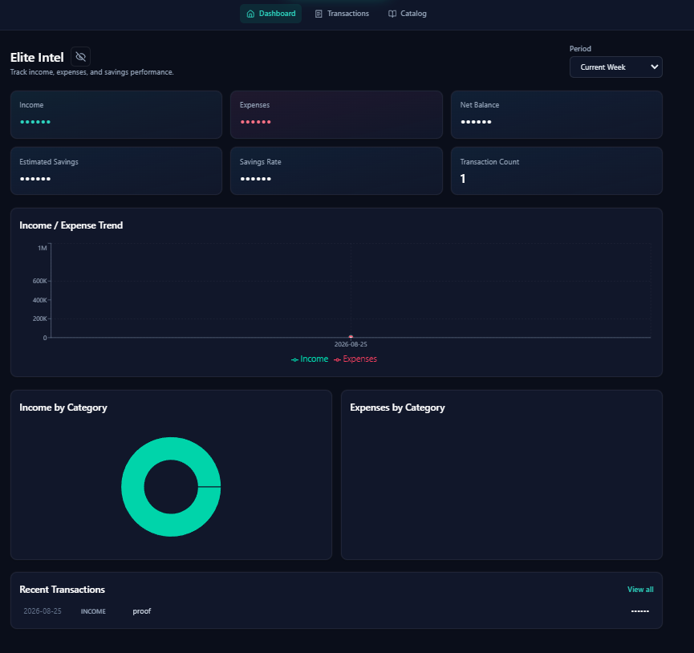
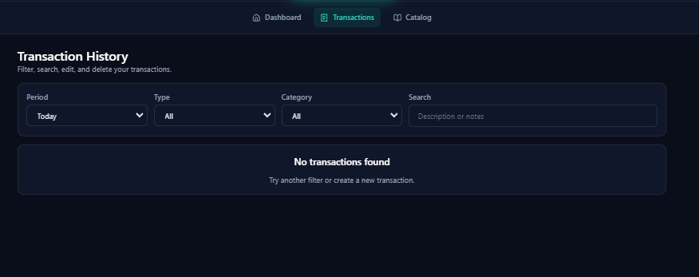
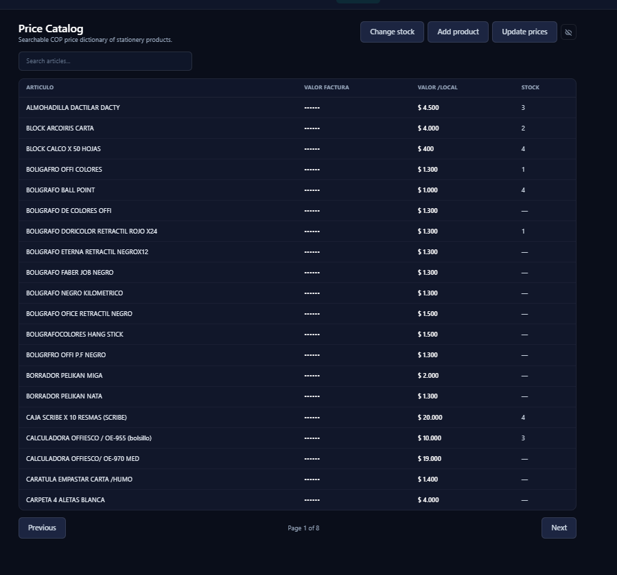
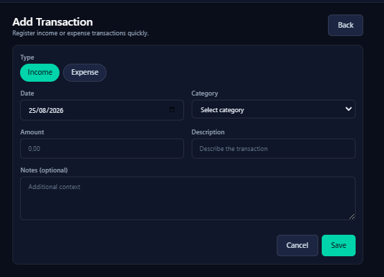

<div align="center">


# Elite Intel

**Desktop business intelligence for a Colombian stationery store - zero cloud, zero subscriptions.**

Financial KPIs, product catalog, transaction management, and Excel bidirectional sync in a one-click Electron app powered by FastAPI + React + SQLite.

[](LICENSE)
[](https://python.org)
[](https://react.dev)
[](https://electronjs.org)
[]()

</div>

---

## Visual Gallery

<details open>
<summary><strong>Dashboard - Financial KPIs &amp; Analytics</strong></summary>
<br>



> Real-time financial summary: income, expenses, net balance, savings rate, and time series by day/week/month.

</details>

<details>
<summary><strong>Product Catalog - Stock &amp; Price Management</strong></summary>
<br>



> 148 articles with search, filters, bulk stock updates, and per-item price editing.

</details>

<details>
<summary><strong>Excel Bidirectional Sync</strong></summary>
<br>



> Every price or stock change syncs back to `PRECIOS_PRODUCTOS_PAPELERIA.xlsx`, preserving the original spreadsheet structure.

</details>

<details>
<summary><strong>Transaction Management</strong></summary>
<br>



> Paginated list with date range, type, category, and text search filters.

</details>

<details>
<summary><strong>Add Transaction Form</strong></summary>
<br>



> Quick entry with category picker and built-in validation.

</details>

---

## Features

| Area | Capability | Detail |
|------|-----------|--------|
| **Dashboard** | Financial KPIs | Income, expenses, net balance, estimated savings, savings rate |
| **Dashboard** | Time Series | Day, week, or month granularity via `GET /dashboard/timeseries` |
| **Dashboard** | Category Breakdown | Revenue and expense distribution across categories |
| **Catalog** | 148 Articles | Full CRUD with active/inactive state toggle |
| **Catalog** | Bulk Stock Update | Atomic `POST /products/stock/bulk` from consolidated view |
| **Catalog** | Bulk Price Update | Atomic `POST /products/prices/bulk` or per-item `PATCH` |
| **Transactions** | Full CRUD | Create, read, update, delete with validation |
| **Transactions** | Advanced Filters | Date range, type, category, free-text search |
| **Data Sync** | Excel Bidirectional | Writes changes back to the source `.xlsx` automatically |
| **Data Sync** | CSV Replication | Transactions replicate to `2026-2.csv` journal |
| **Desktop** | One-Click Install | `install.bat` handles Node, Python, dependencies, build |
| **Desktop** | Offline by Design | SQLite per machine, no internet required |

---

## Quick Start

### Option A - One-Click Install (Windows)

1. Clone or download the repo to a local Windows folder (e.g. `C:\elite-intel`).
   > Do **not** run from a network path like `\\wsl.localhost\...`.

2. Double-click **`install.bat`**.

3. Accept the single confirmation prompt.

   The installer runs unattended:
   - Installs Node.js and Python if missing
   - Installs all dependencies
   - Builds the frontend
   - Packages `elite-intel.exe`
   - Creates a desktop shortcut

4. Launch **Elite Intel** from the desktop icon.

### Option B - From Source

```bash
git clone https://github.com/macreat/elite-intel.git
cd elite-intel

# Backend
cd backend
python -m venv .venv
.venv\Scripts\activate
pip install -r requirements.txt
uvicorn main:app --reload

# Frontend
cd ../frontend
npm install
npm run dev
```

For Docker-based development (Postgres + backend + frontend), see `docker-compose.yml`.

---

## Architecture

```
┌─────────────────────────────────────────────────┐
│                  Electron Shell                  │
│  ┌──────────────┐       ┌────────────────────┐  │
│  │  React SPA   │◄─────►│   FastAPI Backend  │  │
│  │  (Vite dev / │  HTTP │   (uvicorn)        │  │
│  │   built)     │       │                    │  │
│  └──────────────┘       └────────┬───────────┘  │
│                                  │               │
│                    ┌─────────────▼────────────┐  │
│                    │       SQLite DB          │  │
│                    │     (elite.db)           │  │
│                    └─────────────┬────────────┘  │
│                                  │               │
│                    ┌─────────────▼────────────┐  │
│                    │   Excel / CSV Sync       │  │
│                    │  PRECIOS_PRODUCTOS_...   │  │
│                    └──────────────────────────┘  │
└─────────────────────────────────────────────────┘
```

**Development** uses Docker Compose with PostgreSQL. **Production** runs the backend with a local Python venv and SQLite - no containers, no cloud.

---

## API Reference

| Method | Endpoint | Description |
|--------|----------|-------------|
| `GET` | `/dashboard/summary` | Financial summary for a period |
| `GET` | `/dashboard/categories` | Revenue/expense breakdown by category |
| `GET` | `/dashboard/timeseries` | Time series (`day`, `week`, `month`) |
| `GET` | `/products` | Product list with category and state filters |
| `POST` | `/products` | Create a product |
| `PATCH` | `/products/{id}` | Update product name and prices |
| `GET` | `/products/{id}` | Get product by ID |
| `PATCH` | `/products/{id}/stock` | Update stock for one product |
| `POST` | `/products/stock/bulk` | Bulk stock update (atomic) |
| `POST` | `/products/prices/bulk` | Bulk price update (atomic) |
| `GET` | `/transactions` | Paginated transactions with filters |
| `POST` | `/transactions` | Create a transaction |
| `GET` | `/transactions/{id}` | Get transaction by ID |
| `PUT` | `/transactions/{id}` | Update a transaction |
| `DELETE` | `/transactions/{id}` | Delete a transaction |
| `GET` | `/categories` | Category list with type filter |
| `POST` | `/categories` | Create a category |
| `PUT` | `/categories/{id}` | Update a category |
| `DELETE` | `/categories/{id}` | Soft-delete (deactivate) a category |

Full OpenAPI spec at [`docs/api/openapi.json`](docs/api/openapi.json).

---

## Tech Stack

| Layer | Technology | Why |
|-------|-----------|-----|
| **Runtime** | Electron | Ship as a native `.exe` with bundled backend |
| **Frontend** | React 19 + Vite | Fast HMR in dev, optimized static build for prod |
| **Backend** | FastAPI (Python 3.12) | Async, auto-generated OpenAPI docs, type-safe |
| **Database** | SQLite | Zero-config, per-machine, portable, no server |
| **Data Sync** | openpyxl + csv | Read/write Excel in-place, CSV journal replication |
| **Packaging** | PyInstaller | Single executable, no Python install required end-user |

---

## Data Locations

| File | Purpose |
|------|---------|
| `backend/data/raw/PRECIOS_PRODUCTOS_PAPELERIA.xlsx` | Source-of-truth price catalog. Written back by the app on every change. |
| `backend/elite.db` | SQLite production database (created on first run) |
| `backend/data/raw/2026-2.csv` | Journal CSV - transactions replicate here automatically |

---

## Development

- **Backend docs**: `backend/README.md`
- **Frontend notes**: `frontend/src/README.md`
- **Docker stack**: `docker-compose.yml` (Postgres + API + frontend)
- **API spec**: `docs/api/openapi.json`
- **Client presentation**: `docs/presentation.html`

---

<div align="center">

**Elite Intel** - Built for a specific business, designed to work without the cloud.

</div>
