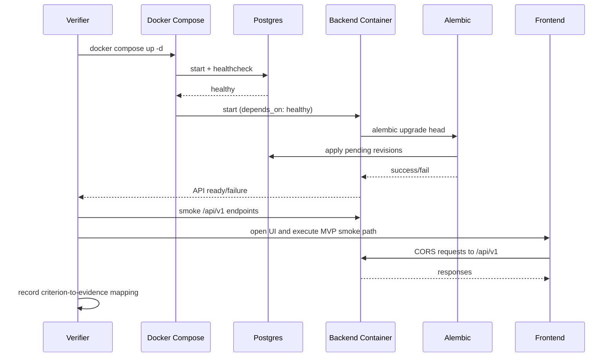
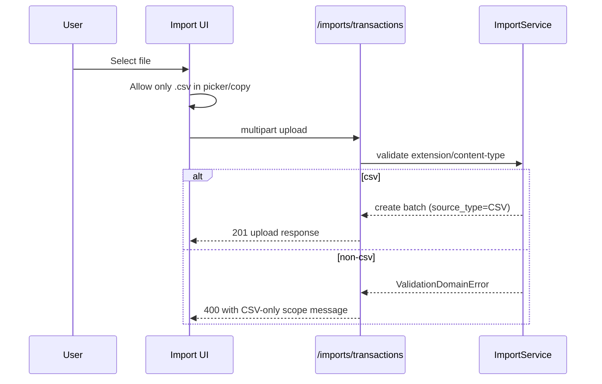

# Design: MVP Integration Hardening

## Technical Approach

This change hardens MVP acceptance without redesigning domain architecture. The implementation strategy is: (1) run live stack verification on Docker Compose with Postgres and Alembic-on-boot, (2) enforce and communicate CSV-only import scope at backend/frontend boundaries, and (3) update acceptance evidence so checklist items are only checked when directly proven in this execution. This maps to spec requirements: Live Integration Verification, CSV-Only Import Contract, and Acceptance Evidence Boundaries.

## Architecture Decisions

| Decision | Options | Tradeoffs | Decision | Rationale |
|---|---|---|---|---|
| Integration acceptance gate | A) Keep SQLite-only pytest as acceptance proof B) Require live Compose smoke on Postgres | A is fast but misses target-runtime failures; B is slower but validates real boot/migration/CORS/runtime path | **B** | Requirement explicitly mandates containerized live verification before acceptance.
| Import format contract | A) Keep CSV+Excel behavior B) Restrict MVP to CSV only | A keeps broader legacy claims but conflicts with current change scope; B narrows behavior and docs but may reject files accepted before | **B** | Spec requires CSV-only and explicit rejection of non-CSV input.
| Evidence policy | A) Infer acceptance from prior/local assumptions B) Evidence-link each checked criterion | A is faster but non-auditable; B adds process overhead but enables independent review | **B** | Spec requires direct execution evidence and unchecked state when proof is missing.
| Data model compatibility | A) Remove EXCEL enum/types now B) Keep schema enum, constrain accepted input path | A is cleaner but introduces migration risk beyond scope; B leaves harmless legacy value while enforcing MVP behavior | **B** | Proposal excludes unrelated redesign; hardening should be minimal and low-risk.

## Data Flow

Live verification flow:



CSV contract flow:



## File Changes

| File | Action | Description |
|---|---|---|
| `backend/app/services/import_service.py` | Modify | Enforce CSV-only upload acceptance and reject non-CSV inputs deterministically. |
| `backend/tests/test_import_api.py` | Modify | Add/adjust tests for non-CSV rejection and CSV-only contract behavior. |
| `frontend/src/components/import/UploadStep.tsx` | Modify | Change user-facing copy and input `accept` to CSV-only. |
| `tasks/mvp-implementation.md` | Modify | Check §5 criteria only when linked evidence exists from this run. |
| `.env.example` | Modify (if needed) | Align runtime DB URL guidance with psycopg driver convention used by compose/backend. |
| `openspec/changes/mvp-integration-hardening/design.md` | Create | This design artifact. |

## Interfaces / Contracts

No new endpoints are added.

Behavioral contract updates:

```text
POST /api/v1/imports/transactions
- Accepts: CSV uploads only
- Rejects: non-CSV formats with 400 ValidationDomainError
- Messaging: MUST state CSV-only scope
```

Acceptance evidence contract:

```yaml
criterion: "Frontend builds"
status: checked|unchecked
evidence:
  command: "cd frontend && npm run build"
  result: "pass|fail"
  timestamp: "ISO-8601"
```

## Testing Strategy

| Layer | What to Test | Approach |
|---|---|---|
| Unit | CSV-only validation branch in import service | Add focused tests for extension/content-type acceptance and rejection paths. |
| Integration | API import/upload/mapping/confirm behavior against current backend stack | Extend `backend/tests/test_import_api.py` with non-CSV rejection; keep existing all-or-nothing checks. |
| E2E | Live stack acceptance (Postgres health, Alembic, `/api/v1` smoke, frontend smoke, CORS) | Manual Docker Compose runbook execution with explicit evidence capture per criterion. |

## Threat Matrix

This change includes process integration (Compose/Alembic runtime verification), so matrix applicability is evaluated below.

| Boundary | Minimum adversarial cases | Applicability | Design response | Planned RED tests |
|---|---|---|---|---|
| Documentation-like paths | `requirements.txt`, `CMakeLists.txt`, executable Markdown/MDX, `README.sh` | N/A — no executable-file classification logic introduced | None | None |
| Git repository selection | `git -C`, relative paths, absolute paths | N/A — no git automation/script in scope | None | None |
| Commit state | staged, `commit -a`, empty index | N/A — commit splitting is manual workflow, not tool logic | None | None |
| Push state | tracking branch, first push, explicit refspec | N/A — no push automation in scope | None | None |
| PR commands | explicit `--head`, environment prefix, composed commands | N/A — no PR command composition in scope | None | None |

## Migration / Rollout

No schema migration required for this hardening itself. Rollout order: verify live stack → apply CSV-only contract changes → re-run smoke/build/typecheck evidence → update acceptance checklist.

## Open Questions

- [ ] If Docker cannot run in the execution environment, which manual fallback evidence source is acceptable for temporary partial status?

## Authorized Remediation Contract - Phase 10

The newly authorized remediation keeps the existing import API and transaction model while making five runtime contracts explicit.

### Import identity

`record_fingerprint` remains the semantic fingerprint of normalized transaction content and is used to detect equivalent transactions across different source batches.

`source_fingerprint` is the exact source-row identity, derived from the immutable upload content hash and source row number.

The source fingerprint is unique because retries and concurrent confirmation of one source row must be idempotent.

The semantic fingerprint is not unique by itself because two identical rows in one source file can represent two legitimate transactions.

Mapping therefore retains repeated rows from the same source, while confirmation serializes cross-source semantic checks and rolls back the complete batch when an equivalent transaction already exists elsewhere.

### Staged-file storage

The backend stores staged files below `IMPORT_STORAGE_DIR`.

Compose MUST mount a named `import_storage` volume at that path so the database's `storage_path` remains readable after backend container recreation.

Pending and validated batches are recoverable by a new backend process because their source bytes and mapping metadata are persisted independently of the container filesystem.

### Frontend API configuration

`VITE_API_BASE_URL` is supplied as a Docker build argument for static builds and as a container environment variable for runtime configuration.

The browser resolves runtime configuration first, then the build-time value, and only uses the local development default when running an explicitly local development server.

### Calendar and timeseries behavior

Date-only transaction form values represent local midnight in the browser's resolved IANA timezone and are serialized as the corresponding UTC instant.

Dashboard timeseries aggregation receives the requested IANA timezone and converts each persisted UTC instant to that zone before deriving its calendar bucket.
